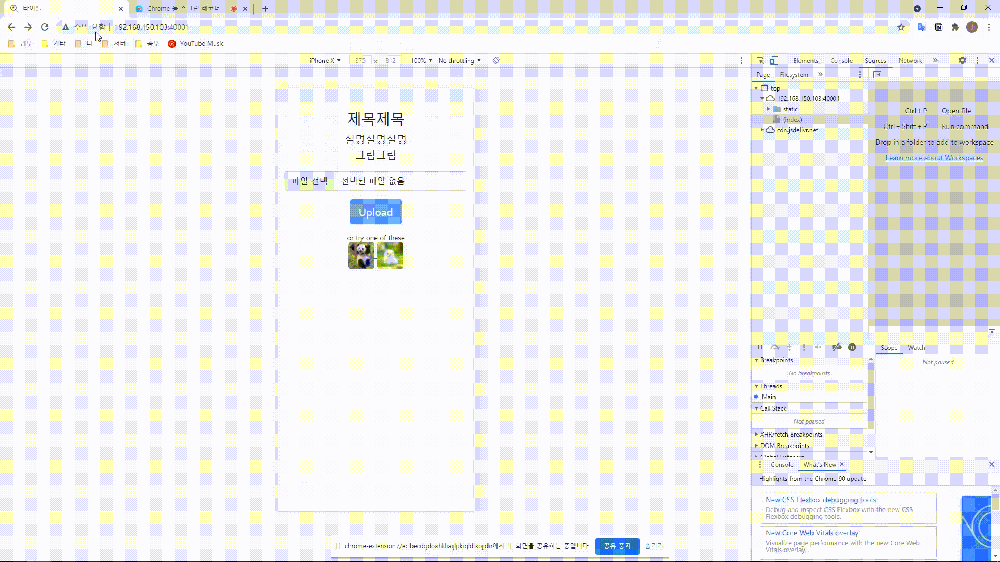

## 1. git clone 
```console
$ git clone https://github.com/jamjam0109/mbo.git
$ cd mbo 
```

## 2. virtualenv 세팅
```console
$ virtualenv venv 
$ source venv/bin/activate
```

## 3. pip install
```console
$ pip install -r requirements.txt
```
 
## 4. 실행 
```console
$ python app.py
```


